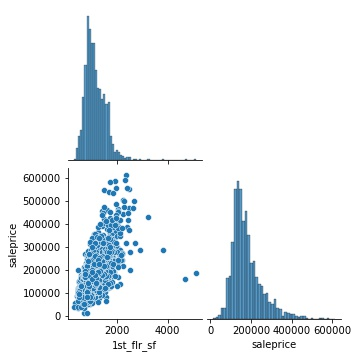
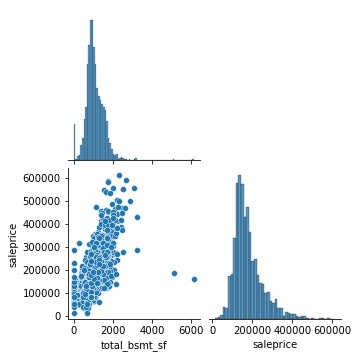
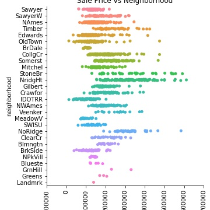

# Project 2: Ames Housing Data and Kaggle Challenge

---
## Problem Statement

Keller Williams Ames wants to gain a competive advantage against other brokerages in the area. They want to predict the sale price of new homes on the market, to help both their seller agents and buyer agents provide unmatched service to their clients.

## Data Dictionary

#### Ames Housing Data Dictionary
|Feature|Type|Dataset|Description|
|---|---|---|---|
|**overall_qual**|*int*|Ames Housing Data|Overall Quality of home|
|**year_built**|*float*|Ames Housing Data|Year home was originally built|
|**year_remod/add**|*float*|Ames Housing Data|Year home was remodeled|
|**mas_vnr_area**|*float*|Ames Housing Data|Masonry vaneer sq ft.|
|**bsmtfin_sf_1**|*float*|Ames Housing Data|Type 1 finished sq ft.|
|**total_bsmt_sf**|*float*|Ames Housing Data|Total basement square footage|
|**1st_flr_sf**|*float*|Ames Housing Data|1st floor sq ft.|
|**gr_liv_area**|*float*|Ames Housing Data|Above ground living area sq ft.|
|**full_bath**|*float*|Ames Housing Data|Number of full baths|
|**totrms_abvgrd**|*float*|Ames Housing Data|Total rooms above ground|
|**garage_yr_blt**|*float*|Ames Housing Data|Year garage was built|
|**garage_area**|*float*|Ames Housing Data|Total garage area sq ft.|
|**fireplaces**|*float*|Ames Housing Data|Number of fireplaces|

Only partial data dictionary, includes features in final model. ([*source for full Ames Housing data dictionary descriptions*](http://jse.amstat.org/v19n3/decock/DataDocumentation.txt))

## Summary of Analysis

In my analysis I found the most optimal linear regression model to use to answer the problem statement. I tested numerical only features in some models. I tried a mixture between categorical and numerical features in other models. I also tested Lasso, Ridge, and Elastic net ridge models and evaluated how that effected my model scores. The metrics I used evaluate and compare my models are the Mean Squared Error (MSE), Mean Absolute Error (MAE), R-squared, and Root Mean Squared Error (RMSE). I aimed to lower my RMSE, MAE, and MSE scores and raise my R-squared score.

Visuals from my exploratory analysis:

  

## Conclusions and Recommendations

Based off all my analysis I recommend using the Benchmark Model. This model performed the best out of all models and gives the best predictive power. The features included in this model are:
* overall quality 
* house year built 
* house year remod/add 
* masonry vaneer area
* finsished basement sq ft
* total basement sq ft 
* 1st floor sq ft 
* above ground living area 
* number of full bath 
* total rooms above ground
* garage yearr built 
* number of cars garage 
* garage area sq ft.
* bedrooms above ground 
* number offireplaces

Some improvements to consider for this model are using more up to date housing data from the MLS. Next slowly add in important categorical features slowly into the model and test how those addititons impact the model scores. Finally further investigate full bath, garage year built, and number of bedrooms above the ground and see why the model causes these features to have negative impact.